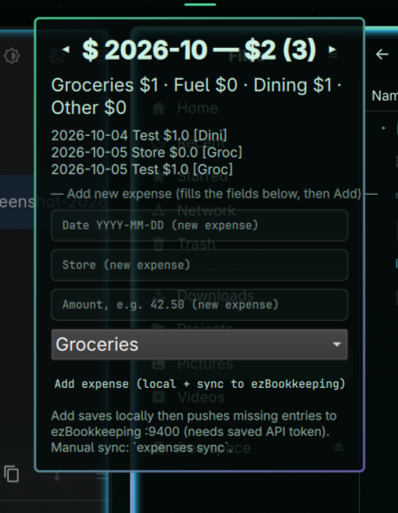
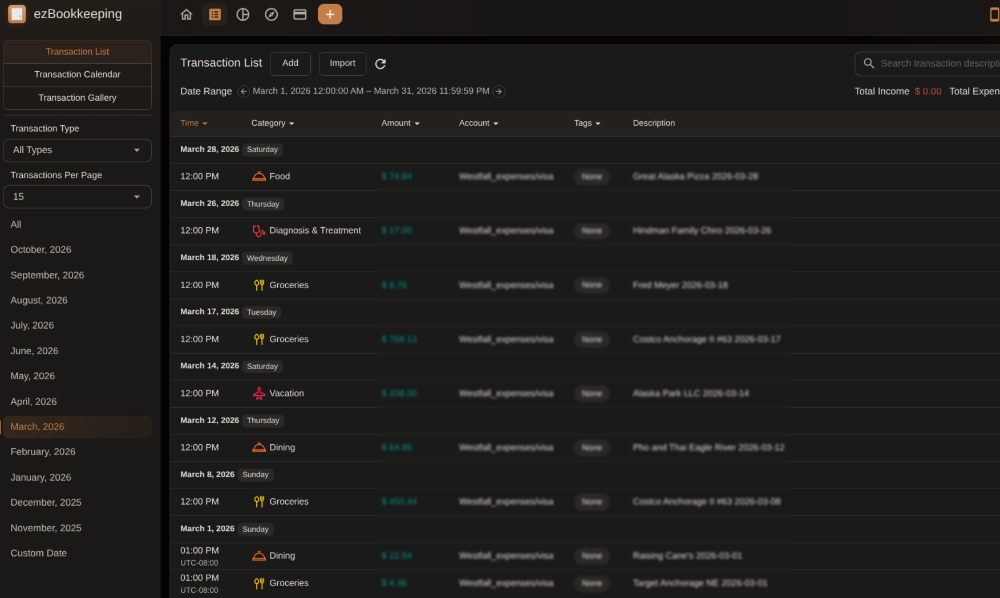

# Expenses

Monthly expense tracker for the Omarchy bar. Manual entry with Groceries / Fuel / Dining / Other categories, monthly totals with ◀ ▶ month browsing, and optional sync to a local [ezBookkeeping](https://ezbookkeeping.mayswind.net/) Docker container (including receipt photos).





## Install

```sh
omarchy plugin add https://github.com/Wardad52/expenses.git --enable
```

Or clone manually into `~/.config/omarchy/plugins/io.github.wardad52.expenses/` and enable:

```sh
omarchy plugin enable io.github.wardad52.expenses
omarchy-shell shell rescanPlugins
```

## Usage

- Click the `$` widget: shows current-month total · count. `⚠N` prefix means N receipts need attention.
- ◀ ▶ browse past months (local data). Transaction list shows first 15 rows.
- Add new expense: fill Date / Store / Amount, pick category, click Add (saves locally, then auto-syncs to ezBookkeeping if an API token is saved).
- Receipt photos: drop JPGs directly in your receipts folder; `bin/expenses-auto-import` (every 5 min via systemd timer) OCRs, pushes with photo, and files them. Failures notify + persist in the widget.

## ezBookkeeping setup (optional, local Docker)

```sh
docker run -d --name ezbookkeeping --restart unless-stopped -p 9400:8080 \
  -e EBK_SECURITY_ENABLE_API_TOKEN=true \
  -e EBK_SERVER_DOMAIN=localhost -e EBK_SERVER_ROOT_URL=http://localhost:9400/ \
  -v ~/.local/share/ezbookkeeping/data:/ezbookkeeping/data \
  -v ~/.local/share/ezbookkeeping/storage:/ezbookkeeping/storage \
  mayswind/ezbookkeeping:latest
# open http://localhost:9400, register, User Settings → Security → Generate API token (pick 365 days expiry), then:
~/.config/omarchy/plugins/io.github.wardad52.expenses/bin/expenses set-token <TOKEN>
```

Manual sync anytime: `bin/expenses sync`.

## Remove

```sh
omarchy plugin remove io.github.wardad52.expenses
```

Local data (`~/.local/share/warren.expenses/`) and ezBookkeeping container are untouched by removal.
